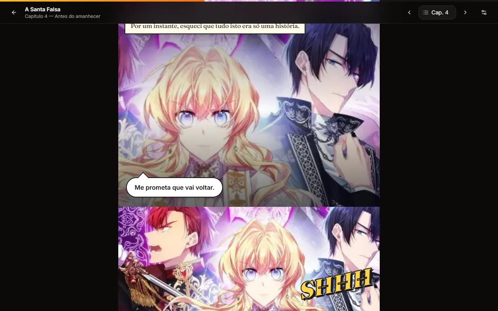
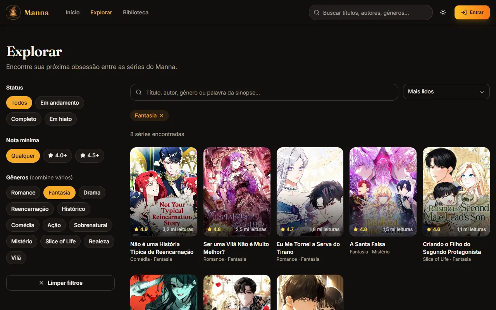
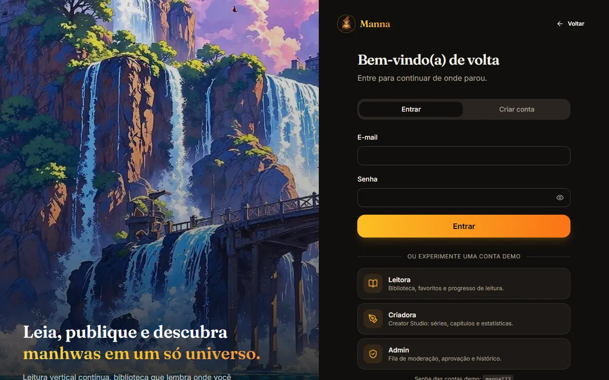
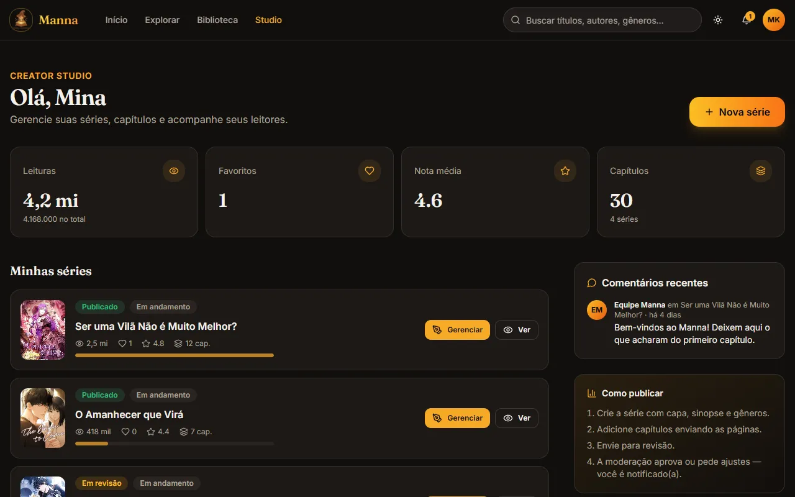
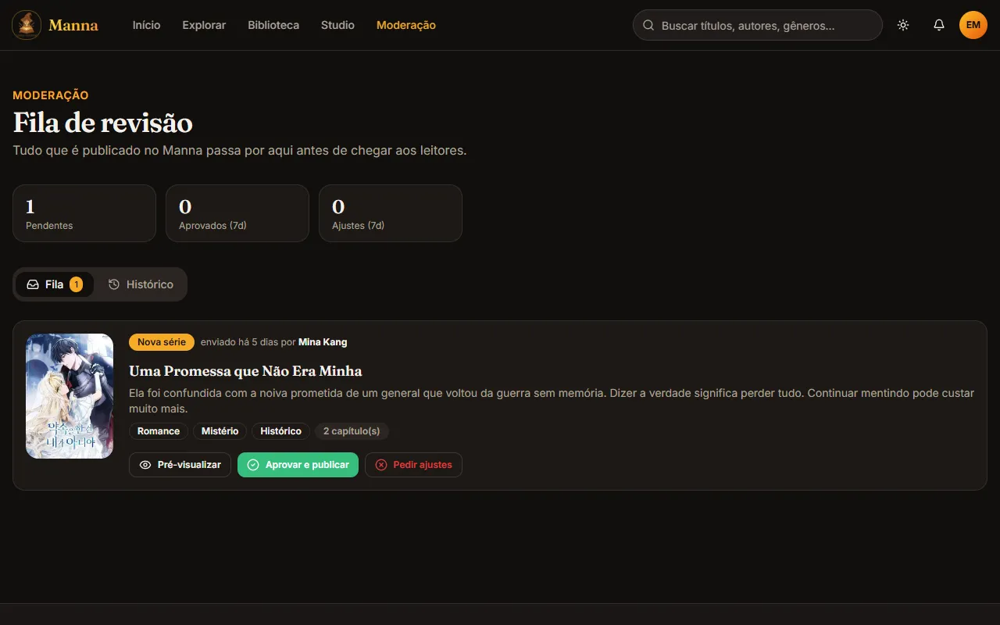

<div align="center">


# Manna

**Leia, publique e descubra manhwas em um só universo.**

Plataforma de leitura e publicação de manhwas (webtoons) com leitor vertical contínuo,
biblioteca pessoal, Creator Studio para autores e fluxo de moderação.

[](https://github.com/VitoriaMir/Manna/actions/workflows/deploy.yml)


### [▶ Abrir a demonstração](https://vitoriamir.github.io/Manna/)


</div>

---

## Sobre o projeto

O Manna reúne em um só lugar as três pontas de uma plataforma de webtoons:

- **quem lê** tem um leitor vertical pensado para o formato, que lembra onde parou, e uma biblioteca com favoritos e progresso;
- **quem cria** tem um estúdio para publicar séries e capítulos, com upload em lote e estatísticas;
- **quem modera** tem uma fila de revisão: todo conteúdo novo passa por aprovação antes de chegar ao catálogo, e quem criou recebe o retorno.

A demonstração roda **100% no navegador**, sem servidor: é um site estático no GitHub Pages, e contas, favoritos, séries publicadas e imagens enviadas ficam salvos no próprio navegador (`localStorage` + `IndexedDB`). Dá para testar tudo, inclusive publicar uma série e aprová-la como admin.

## Contas de demonstração

Na tela **Entrar** há atalhos para cada perfil. Senha de todas: `manna123`.

| Perfil | E-mail | O que dá para fazer |
| --- | --- | --- |
| Leitora | `leitora@manna.app` | Biblioteca já preenchida, favoritos, progresso, avaliações e comentários |
| Criadora | `criadora@manna.app` | Creator Studio com 4 séries (uma em revisão), estatísticas e publicação |
| Admin | `admin@manna.app` | Fila de moderação, aprovação, pedido de ajustes e histórico |

Você também pode criar sua própria conta, como leitor(a) ou criador(a). Para voltar ao estado original, use **Perfil → Restaurar demonstração**.

## Funcionalidades

### 📖 Leitura
- **Leitor vertical contínuo** com barra de progresso, barras que se escondem ao rolar e navegação entre capítulos (botões, seletor e teclas ← →).
- **Retomar de onde parou**: o progresso de cada capítulo é salvo enquanto você lê.
- **Preferências de leitura**: largura da coluna (estreita, normal, larga) e páginas juntas ou separadas.
- **Comentários por capítulo** e **avaliação de 1 a 5 estrelas** por série.

### 🔍 Descoberta
- Home com **carrossel de destaques**, "Continue lendo", **Em alta** (ranking), **Últimos lançamentos**, **Novidades** e **Mais bem avaliados**.
- **Busca em tempo real** por título, autor, gênero ou trecho da sinopse (ignora acentos).
- **Filtros combináveis** por gêneros, status e nota mínima, com 5 ordenações. Os filtros ficam na URL, então dá para compartilhar uma busca.
- Página da obra com sinopse, estatísticas, lista de capítulos (marca lidos e em andamento) e recomendações por gênero.

### 📚 Biblioteca
- Abas **Lendo**, **Favoritos** e **Em dia**, com progresso geral de cada série.
- **Notificações** quando sai capítulo novo de uma série favoritada.

### 🎨 Creator Studio
- Painel com **leituras, favoritos, nota média e capítulos**, lista de séries e comentários recentes dos leitores.
- Criação e edição de séries: capa, sinopse, status e até 5 gêneros.
- **Upload de páginas em lote** com arrastar e soltar, ordenação automática pelo nome do arquivo e reordenação manual. As imagens são **redimensionadas e convertidas para WebP no navegador** antes de serem salvas.
- Fluxo **Rascunho → Em revisão → Publicado** (ou **Ajustes pedidos**, com a mensagem da moderação).

### 🛡️ Moderação
- **Fila de revisão** com pré-visualização da série ou do capítulo.
- **Aprovar e publicar** ou **pedir ajustes** (com sugestões rápidas de motivo).
- **Histórico** de decisões e contadores dos últimos 7 dias.
- Quem criou é **notificado** da decisão; quem favoritou é avisado do novo capítulo.

### ✨ Experiência
- **Tema escuro e claro**, com paleta inspirada no logo (pergaminho, couro e dourado).
- **Responsivo**: navegação inferior no celular e menu lateral.
- **Acessibilidade**: navegação por teclado, foco visível, rótulos ARIA, link "pular para o conteúdo" e respeito a `prefers-reduced-motion`.
- Perfil com foto, bio, **conquistas calculadas a partir do uso real**, troca de senha e **exportação dos seus dados em JSON**.

## Telas

| Obra | Leitor |
| --- | --- |
|  |  |
| **Explorar** | **Entrar** |
|  |  |
| **Creator Studio** | **Moderação** |
|  |  |

<p align="center">
  
  &nbsp;&nbsp;
  
</p>

## Stack

| Camada | Tecnologia |
| --- | --- |
| Framework | [Next.js 14](https://nextjs.org/) (App Router) com `output: 'export'` |
| Interface | React 18, [Tailwind CSS](https://tailwindcss.com/), componentes no estilo [shadcn/ui](https://ui.shadcn.com/) sobre [Radix UI](https://www.radix-ui.com/) |
| Ícones e feedback | [Lucide](https://lucide.dev/), [Sonner](https://sonner.emilkowal.ski/) |
| Tema | [next-themes](https://github.com/pacocoursey/next-themes) |
| Tipografia | Inter e Fraunces (`next/font`) |
| Dados (demo) | `localStorage` para o estado, `IndexedDB` para imagens |
| Imagens | [sharp](https://sharp.pixelplumbing.com/) no build dos assets, Canvas + WebP no navegador para uploads |
| Deploy | GitHub Actions → GitHub Pages |

## Arquitetura

```
┌──────────────┐   usa    ┌──────────────┐   lê/grava   ┌───────────────────────────┐
│  Páginas e   │ ───────▶ │  lib/api.js  │ ───────────▶ │ lib/store.js (localStorage)│
│  componentes │          │  (serviço)   │              │ lib/media.js (IndexedDB)   │
└──────────────┘          └──────────────┘              └───────────────────────────┘
```

- **`lib/api.js`** concentra todas as regras de negócio: autenticação, permissões por papel, biblioteca, avaliações, comentários, Creator Studio, fluxo de moderação e notificações. As telas nunca alteram o estado diretamente.
- **`lib/store.js`** é um store mínimo com `useSyncExternalStore`: persiste no `localStorage`, sincroniza entre abas e usa um *snapshot* fixo no build estático para a hidratação não divergir.
- **`lib/media.js`** guarda as imagens enviadas no IndexedDB (o `localStorage` tem limite de ~5 MB) e as referencia no estado como `idb:<chave>`.
- **`lib/seed.js`** define o catálogo inicial (21 séries), as contas demo e dados de exemplo.
- **`lib/demo-pages.js`** gera, de forma determinística, as páginas dos capítulos de demonstração a partir da capa de cada série (enquadramentos, narração, balões e onomatopeias). O catálogo não inclui páginas reais de manhwas por direitos autorais.

Como o site é estático, as rotas dinâmicas usam query string (`/obra/?id=…`, `/ler/?obra=…&cap=…`), o que funciona para séries criadas depois do build.

### Fluxo de publicação

```
Rascunho ──enviar──▶ Em revisão ──aprovar──▶ Publicado
    ▲                    │
    └──── Ajustes pedidos ◀──pedir ajustes (com mensagem)
```

Capítulos novos de uma série já publicada seguem o mesmo fluxo, individualmente.

### Ligando a um backend real

Para produção com usuários reais, reimplemente as funções de `lib/api.js` chamando uma API (mantendo as mesmas assinaturas) e troque `lib/media.js` por upload para um storage (S3, Cloudinary etc.). As telas não precisam mudar. A autenticação local da demo (hash SHA-256 no navegador) **não é segura para produção**: use um provedor como Auth0, Clerk ou Supabase Auth.

A primeira versão do projeto tinha rotas de API com MongoDB, JWT e Auth0. Esse código está preservado em [`legacy/`](legacy/) como referência e não faz parte do build.

## Rodando localmente

Pré-requisito: **Node.js 18.17+** (recomendado 22).

```bash
git clone https://github.com/VitoriaMir/Manna.git
cd Manna
npm install
npm run dev        # http://localhost:3000
```

Build de produção (gera o site estático em `out/`):

```bash
npm run build
npm start          # serve a pasta out/ localmente
```

### Scripts

| Comando | Descrição |
| --- | --- |
| `npm run dev` | Servidor de desenvolvimento |
| `npm run build` | Exporta o site estático para `out/` |
| `npm start` | Serve `out/` localmente |
| `npm run images` | Regenera as imagens otimizadas de `public/images/` a partir de `assets/` |

### Variáveis de ambiente (opcionais)

| Variável | Uso |
| --- | --- |
| `NEXT_PUBLIC_BASE_PATH` | Prefixo das URLs quando o site não fica na raiz do domínio (ex.: `/Manna` no GitHub Pages) |
| `NEXT_PUBLIC_SITE_ORIGIN` | Origem usada nas metatags Open Graph (padrão: `https://vitoriamir.github.io`) |

## Deploy no GitHub Pages

O workflow [`.github/workflows/deploy.yml`](.github/workflows/deploy.yml) publica o site a cada push na `main`:

1. instala as dependências com `npm ci`;
2. faz o build estático com o `basePath` do repositório;
3. publica a pasta `out/` no GitHub Pages.

Em um fork, ative em **Settings → Pages → Source: GitHub Actions**.

## Estrutura

```
Manna/
├── app/                    # Rotas (App Router)
│   ├── page.js             # Home
│   ├── explorar/           # Busca e filtros
│   ├── obra/               # Detalhes da série (?id=)
│   ├── ler/                # Leitor vertical (?obra=&cap=)
│   ├── biblioteca/         # Lendo, favoritos, em dia
│   ├── entrar/             # Login e cadastro
│   ├── perfil/             # Perfil, conquistas e conta
│   ├── studio/             # Creator Studio (+ studio/obra para edição)
│   └── moderacao/          # Fila e histórico de moderação
├── components/
│   ├── ui/                 # Botões, inputs, diálogos, abas…
│   ├── layout/             # Header, navegação móvel, rodapé
│   ├── manhwa/             # Cards, avaliação, comentários, página da obra
│   ├── reader/             # Leitor e páginas de demonstração
│   └── home/ explore/ library/ studio/ moderation/ profile/ auth/
├── lib/                    # api, store, media, seed, utilitários
├── public/images/          # Capas, fundos e logo otimizados (WebP/PNG)
├── assets/                 # Imagens originais (fonte do npm run images)
├── scripts/                # Otimização de imagens
├── docs/screenshots/       # Imagens deste README
└── legacy/                 # Versão anterior (API com MongoDB/Auth0), fora do build
```

## Limitações da demonstração

- Os dados ficam **apenas no navegador** em que foram criados: outra pessoa não vê o que você publicou, e limpar os dados do site apaga tudo.
- A autenticação é simulada e serve só para demonstrar os perfis e permissões.
- Os capítulos do catálogo inicial usam páginas geradas a partir das capas; capítulos enviados pelo Studio usam as imagens reais enviadas.

## Roadmap

- [ ] Backend real (API + banco + storage de imagens) mantendo o contrato de `lib/api.js`
- [ ] Autenticação com provedor externo e login social
- [ ] Modo offline (PWA) para capítulos baixados
- [ ] Seguir criadores e feed de atualizações
- [ ] Estatísticas por capítulo com gráfico de retenção de leitura
- [ ] Internacionalização (pt-BR / en)

## Créditos

As capas usadas no catálogo de demonstração pertencem aos seus respectivos autores e editoras e aparecem apenas para ilustrar a interface. Títulos, sinopses, autores e números do catálogo são fictícios.

## Licença

Distribuído sob a licença MIT. Veja [LICENSE](LICENSE).

---

<div align="center">Feito com ☕ e muitos capítulos por <a href="https://github.com/VitoriaMir">Vitória Miranda</a>.</div>
